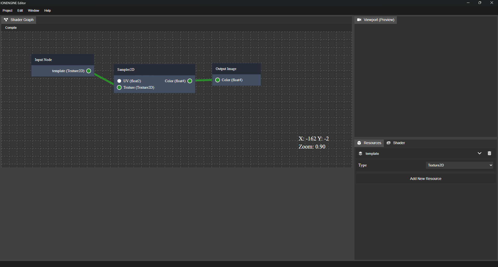
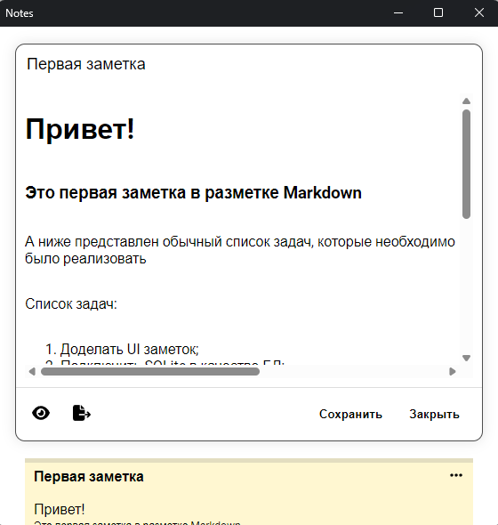

## Features

* Rapid development of desktop applications using the Web technologies
* Minimum application weight due to the use of the WebView system component
* A very simple library with a simple C/C++ interface
* Supports bindings of an async functions (only C++)

## Build

### Requirements

* Windows
    * WebView2 Edge
    * Python 3.10+ (Optional)
    * Microsoft Visual Studio /or Build Tools 2022

* Linux
    * GTK 4
    * WebkitGTK 6.0
    * LibAdwaita 1.0
    * Python 3.10+ (Optional)
    * Clang 18

## Examples

```c++
#include <webview.hpp>

int32_t main(int32_t argc, char** argv) {
    try 
    {
        libwebview::App app("TestApp", "Test App", 800, 600, true, true);
        app.run("resources/index.html");
        return EXIT_SUCCESS;
    } 
    catch(std::runtime_error e) 
    {
        std::cerr << e.what() << std::endl;
        return EXIT_FAILURE;
    }
}
```

```c++
#include <webview.hpp>

int32_t main(int32_t argc, char** argv) {
    try 
    {
        libwebview::App app("TestApp", "Async App", 800, 600, true, true);

        app.bind("asyncHelloWorld", []() -> libwebview::result<void> {
            // Emulate high load work
            std::this_thread::sleep_for(std::chrono::seconds(5));
            std::cout << "Async hello world!" << std::endl;
            co_return;
        });

        app.run("resources/index.html");
        return EXIT_SUCCESS;
    } 
    catch(std::runtime_error e) 
    {
        std::cerr << e.what() << std::endl;
        return EXIT_FAILURE;
    }
}
```

## Python Bindings

### Install

```bash
pip install libwebview
```

### Python Example

```python
from libwebview import App

app = App(
    app_name="TestApp",
    title="Test App", 
    size=(800, 600), 
    resizeable=True)
app.set_max_size((0, 0))
app.set_min_size((500, 400))

def window_close():
    app.quit()

app.bind(window_close)

app.run("resources/index.html")
```

## Showcase

### [IONENGINE - Editor](https://github.com/a3st/IONENGINE)


### [Notes](https://github.com/a3st/Notes)


## Roadmap

- [x] Windows implementation (WebView2 Edge)
- [x] Linux implementation (WebKit)